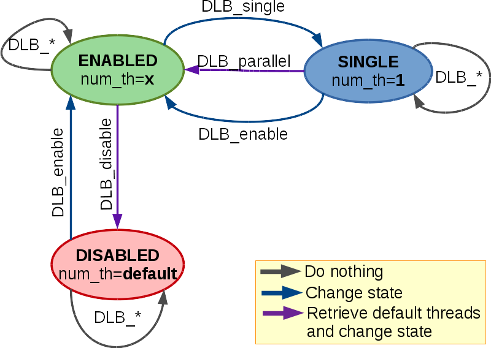

*******************
Public API
*******************

The DLB API can be divided into:

.. glossary::

    Basic set
        The basic set is very simple and reduced and oriented to application developers.
        The different functions will be explained in detail in section :ref:`basic-api`.

    Advanced set
        The advanced set is oriented to programming model runtimes but can be used by
        applications also.  The advanced functions will be explained in detail in section
        :ref:`advanced-api`.

    MPI API
        This is a specific API for MPI. We offer an MPI interface that will be called by
        Extrae if we are tracing the application or internally in the MPI intercept API.
        All the calls of this API are of the form shown below, and thus not documented.

        - DLB_<mpi_call_name>_enter(...)
        - DLB_<mpi_call_name>_leave(...)

..        There is one API function that is aimed to be called by the user, explained in section :ref:`mpi-api`.

..     Statistics
..         This set of functions allows the user to obtain some statistics about CPU usage.
..         For a more detailed description see :ref:`statistics`. These functions are described
..         in section :ref:`stats-api`.
.. 
..     Dynamic Resource Ownership Manager
..         With these functions, the user can manage from an external process the CPU
..         ownership of each DLB running process. For a more detailed description see
..         :ref:`drom`. These functions are described in section :ref:`drom-api`.

.. _basic-api:

====================
Basic set of DLB API
====================

This API is intended to give hints from the application to DLB. With this hints DLB is able to make
a more efficient use of resources.

.. function:: void DLB_disable(void)

    Will disable any DLB action. And reset the resources of the process to its default. While DLB
    is disabled there will not be any movement of threads for this process. Useful to limit parts
    of the code were DLB will not be helpful, by disabling DLB we avoid introducing any overhead.

.. function:: void DLB_enable(void)

    Will enable DLB. DLB is enabled by default when the execution starts. And if it was not
    previously disable it will not have any effect. Useful to finish parts of the code were we
    disabled DLB temporally.

.. function:: void DLB_single(void)

    Will lend all the threads of the process except one. Useful to mark parts of the code that are
    serial. The remaining threads can be used by some other process. All the DLB functions will be
    disabled except lending the thread when entering an MPI call, exiting and MPI call, DLB_parallel
    and DLB_enable.

.. function:: void DLB_parallel(void)

    Will claim the default threads and enable all the DLB functions. Useful when exiting a serial
    section of code.

We can summarize the behavior of these functions with the states graph shown in the figure. We can
consider three states for DLB (for each process) *Enabled*, *Disabled* and *Single*.

* *Enabled* would be the default state, where DLB will react to any API call.
* The *Disabled* state will not allow any change in the number of threads (only a call to ``DLB_enable`` will have effect). The number of threads of the process in *Disabled* state will be the default.
* The *Single* state will only react at ``DLB_enable`` or ``DLB_parallel`` API calls. The number of threads of the process in the *Single* state will be 1.

.. _advanced-api:

=======================
Advanced set of DLB API
=======================

The advanced set of calls is designed to be used by runtimes, either in the outer level or the inner
level of parallelism. But advanced users can also use them from applications.

.. function:: void DLB_Init(void)

    Initialize the DLB library and all its internal data structures. Must be called once and only
    one by each process in the DLB system.

.. function:: void DLB_Finalize(void)

    Finalize the DLB library and clean up all its data structures. Must be called by each process
    before exiting the system.

.. function:: void DLB_reset(void)

    Reset the number of threads of this process to its default.

.. function:: void DLB_UpdateResources(void)

    Check the state of the system to update your resources. You can obtain more resources in case
    there are available CPUs.

.. function:: void DLB_UpdateResources_max(int max_resources)

    Check the state of the system to update your resources. You can obtain more resources in case
    there are available CPUs. The maximum number of resources that you can get is ``max_resources``.

.. function:: void DLB_ReturnClaimedCpus(void)

    Check if any of the resources you are using have been claimed by its owner and return it if
    necessary.

.. function:: void DLB_Lend(void)

    Lend all your resources to the system. Except in case you are using the *1CPU* block mode you
    will lend all the resources except one CPU.

.. function:: void DLB_Retrieve(void)

    Retrieve all your default resources previously lent.

.. function:: int DLB_ReleaseCpu(int cpu)

    Lend this CPU to the system. The return value is 1 if the operation was successful and 0
    otherwise.

.. function:: int DLB_ReturnClaimedCpu(int cpu)

    Return this CPU to the system in case it was claimed by its owner. The return value is 1 if
    the CPU was returned to its owner and 0 otherwise.

.. function:: void DLB_ClaimCpus(int cpus)

    Claim as many CPUs as the parameter ``cpus`` indicates. You can only claim your CPUs. Therefore
    if you are claiming more CPUs than the ones that you have lent, you will only obtain as many
    CPUs as you have lent.

.. function:: void DLB_AcquireCpu(int cpu)

    Notify the system that you are going to use this CPU. The system will try to adjust himself to
    this requirement, This function may leave the system in an unstable state. Avoid using it.

.. function:: void DLB_AcquireCpus(dlb_cpu_set_t mask)

    Same as ``DLB_AcquireCpu``, but with a set of CPUs.

.. function:: int DLB_CheckCpuAvailability(int cpu)

    This function returns 1 if your CPU is available to be used, 0 otherwise. Only available for
    policies with autonomous threads.

.. function:: int DLB_Is_auto(void)

    Return 1 if the policy allows autonomous threads 0 otherwise.

.. function:: void DLB_Update(void)

    Update the status of 'Statistics' and 'DROM' modules, like updating the process statistics or
    check if some other process has signaled a new process mask.

.. function:: void DLB_NotifyProcessMaskChange(void)

    Notify DLB that the process affinity mask has been changed. DLB will then query the runtime
    to obtain the current mask.

.. function:: void DLB_NotifyProcessMaskChangeTo(const dlb_cpu_set_t mask)

    Notify DLB that the process affinity mask has been changed.

.. function:: void DLB_PrintShmem(void)

    Print the data stored in the Shared Memory

.. function:: int DLB_SetVariable(const char \*variable, const char \*value)

    Change the value of a DLB internal variable

.. function:: int DLB_GetVariable(const char \*variable, char \*value);

    Get DLB internal variable

.. function:: void DLB_PrintVariables(void);

    Print DLB internal variables

.. .. _stats-api:

.. ====================
.. Statistics Interface
.. ====================
.. 
.. The next set of functions can be used only when the user has enabled the Statistics Module (see
.. :ref:`statistics`). With this interface the user can obtain different statistics about the CPU
.. usage and their ownership.
.. 
.. .. function:: void DLB_Stats_Init(void)
.. 
..     Initialize DLB Statistics Module
.. 
.. .. function:: void DLB_Stats_Finalize(void)
.. 
..     Finalize DLB Statistics Module
.. 
.. .. function:: int DLB_Stats_GetNumCpus(void)
.. 
..     Get the total number of available CPUs in the node
.. 
.. .. function:: void DLB_Stats_GetPidList(int \*pidlist,int \*nelems,int max_len)
.. 
..     Get the PID's attached to this module
.. 
.. .. function:: double DLB_Stats_GetCpuUsage(int pid)
.. 
..     Get the CPU Usage of the given PID
.. 
.. .. function:: double DLB_Stats_GetCpuAvgUsage(int pid)
.. 
..     Get the CPU Average Usage of the given PID
.. 
.. .. function:: void DLB_Stats_GetCpuUsageList(double \*usagelist,int \*nelems,int max_len)
.. 
..     Get the CPU usage of all the attached PIDs
.. 
.. .. function:: void DLB_Stats_GetCpuAvgUsageList(double \*avgusagelist,int \*nelems,int max_len)
.. 
..     Get the CPU Average usage of all the attached PIDs
.. 
.. .. function:: double DLB_Stats_GetNodeUsage(void)
.. 
..     Get the CPU Usage of all the DLB processes in the node
.. 
.. .. function:: double DLB_Stats_GetNodeAvgUsage(void)
.. 
..     Get the number of CPUs assigned to a given process
.. 
.. .. function:: int DLB_Stats_GetActiveCpus(int pid)
.. 
..     Get the number of CPUs assigned to a given process
.. 
.. .. function:: void DLB_Stats_GetActiveCpusList(int \*cpuslist,int \*nelems,int max_len)
.. 
..     Get the number of CPUs assigned to each process
.. 
.. .. function:: int DLB_Stats_GetLoadAvg(int pid, double \*load)
.. 
..     Get the Load Average of a given process
.. 
.. .. function:: float DLB_Stats_GetCpuStateIdle(int cpu)
.. 
..     Get the percentage of time that the CPU has been in state IDLE
.. 
.. .. function:: float DLB_Stats_GetCpuStateOwned(int cpu)
.. 
..     Get the percentage of time that the CPU has been in state OWNED
.. 
.. .. function:: float DLB_Stats_GetCpuStateGuested(int cpu)
.. 
..     Get the percentage of time that the CPU has been in state GUESTED
.. 
.. .. function:: void DLB_Stats_PrintShmem(void)
.. 
..     Print the data stored in the Stats Shared Memory
.. 
.. .. _drom-api:
.. 
.. ==================================
.. Dynamic Resource Manager Interface
.. ==================================
.. 
.. The next set of functions can be used when the user has enabled the Dynamic Resource Ownership
.. Manager (DROM) Module (see :ref:`drom`). With this interface the user can set or retrieve the
.. process mask of each DLB process.
.. 
.. .. function:: void DLB_Drom_Init(void)
.. 
..     Initialize DROM Module
.. 
.. .. function:: void DLB_Drom_Finalize(void)
.. 
..     Finalize DROM Module
.. 
.. .. function:: int DLB_Drom_GetNumCpus(void)
.. 
..     Get the total number of available CPUs in the node
.. 
.. .. function:: void DLB_Drom_GetPidList(int \*pidlist, int \*nelems, int max_len)
.. 
..     Get the PID's attached to this module
.. 
.. .. function:: int DLB_Drom_GetProcessMask(int pid, dlb_cpu_set_t mask)
.. 
..     Get the process mask of the given PID
.. 
.. .. function:: int DLB_Drom_SetProcessMask(int pid, const dlb_cpu_set_t mask)
.. 
..     Set the process mask of the given PID
.. 
.. .. function:: void DLB_Drom_PrintShmem(void)
.. 
..     Print the data stored in the Drom Shared Memory
.. 
.. .. _mpi-api:
.. 
.. =============
.. MPI Interface
.. =============
.. 
.. Unlike all the other MPI functions aimed to be called by Extrae, this one is specifically aimed to
.. be used by the user. It is useful sometimes to block only a single node to synchronize the workload
.. at a certain point while using the CPUs owned by the process to help other processes to reach this
.. point.
.. 
.. .. function:: void DLB_MPI_node_barrier(void)
.. 
..     Blocks until all processes in the same node have reached this routine.
