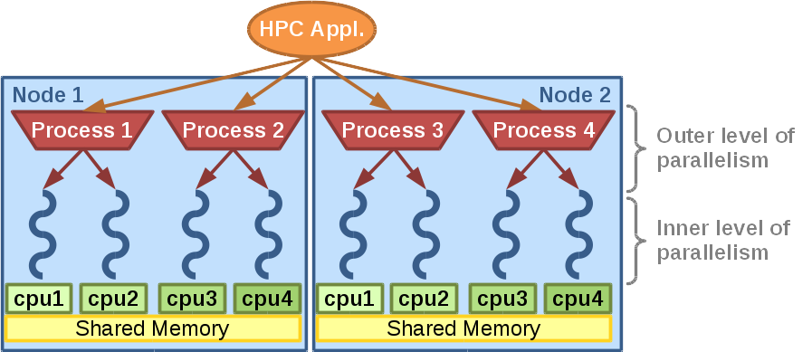
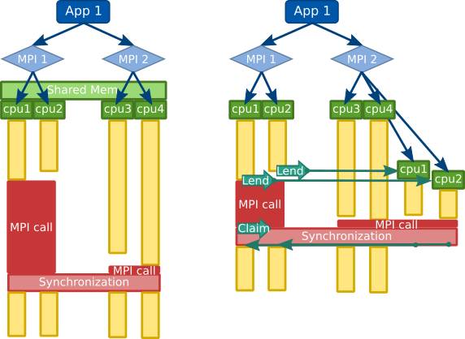
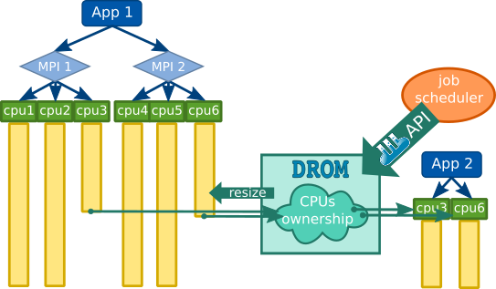

*******************
Introduction to DLB
*******************

The DLB library aims to improve the load balance of HPC hybrid applications (i.e., two levels of parallelism).

In the following picture we can see the structure of a typical HPC hybrid application: one application that will run processes on several nodes, and each process will spawn several threads.

The DLB library will improve the load balance of the outer level of parallelism (e.g MPI) by redistributing the computational resources at the inner level of parallelism (e.g. OpenMP). This readjustment of resources will be done dynamically at runtime.

This dynamism allows DLB to react to different sources of imbalance: Algorithm, data, hardware architecture and resource availability among others.

====================
LeWI: Lend When Idle
====================

The main load balancing algorithm used in DLB is called LeWI (Lend When Idle). The idea of the algorithm is to use the computational resources that are not being used for useful computation to speed up processes in the same computational node.

To achieve this DLB will lend the cpus of a process waiting in a blocking MPI call to another process running in the same node.

.. _drom:

=========================================
Dynamic Resource Ownership Manager (DROM)
=========================================

DROM is a new module included in the DLB library, it offers an API to change
the computational resources assigned to a process at runtime.

