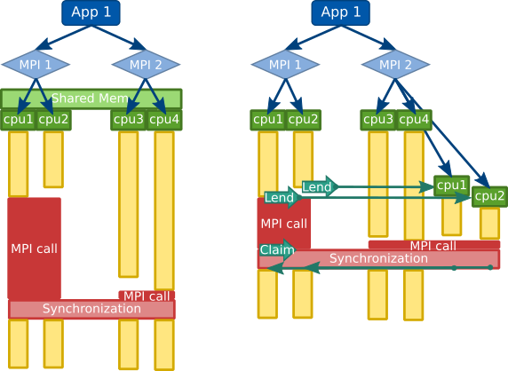
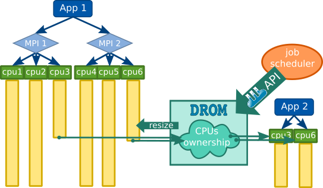

.. _overview:

*******************
Components Overview
*******************

DLB is a collection of tools to improve the load balance of HPC hybrid applications (i.e., two levels of parallelism).

It provides components like :ref:`LeWI <lewi_overview>` or :ref:`DROM <drom_overview>`, that are able to change the resource configuration at runtime.
Additionally, it contains the profiler :ref:`TALP <talp_overview>`, that easily allows to capture performance metrics.

To understand, which applications can benefit from :ref:`LeWI <lewi_overview>` or :ref:`DROM <drom_overview>`, we will have a look at the structure of a typical hybrid HPC application.
As depicted in the picture below, we can see an application that will run processes on several nodes, and each process will spawn several threads.

.. figure:: images/hpc_app.png
  :width: 300pt
  :align: center
  
  Typical hybrid application structure

DLB focuses on improving the load balance of the outer level of parallelism (e.g MPI) by redistributing the computational resources at the inner level of parallelism (e.g. OpenMP). This readjustment of resources will be done dynamically at run time.

This dynamism allows DLB to react to different sources of imbalance: Algorithm, data, hardware architecture and resource availability among others.

.. _lewi_overview:

====================
LeWI: Lend When Idle
====================

The main load balancing algorithm used in DLB is called LeWI (Lend When Idle). 
The idea of the algorithm is to use the computational resources that are not being used for useful computation to speed up processes in the same computational node.

To achieve this DLB will lend the CPUs of a process waiting in a blocking MPI call to another process running in the same node.

  
  Application without LeWI (left) and with LeWI (right)

.. tip::
  If you want to see LeWI in action on your machine, check out our :ref:`Quickstart into using LeWI <lewi_quickstart>`.

.. _drom_overview:

========================================
DROM: Dynamic Resource Ownership Manager
========================================

DROM offers an API to change the computational resources assigned to a process at run time.
TODO: Extend here a bit

  DROM moving CPU ressources between applications

.. _talp_overview:

===========================================
TALP: Tracking Application Live Performance
===========================================

TALP is another module included in DLB that allows to measure the parallel efficiency and other performane metrics. 
The data obtained by TALP is available at run time during the execution, or as a report at the end.

  
  TALP usage example: The collected metrics can be reported through different methods. 
